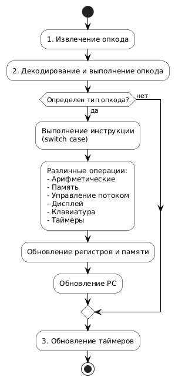

# Создание эмулятора Chip-8: Пошаговое руководство для начинающих

## Введение

Этот документ представляет собой подробное руководство по созданию эмулятора Chip-8, ориентированное на начинающих разработчиков. Chip-8 — это простой интерпретируемый язык программирования, разработанный в 1970-х годах. Создание эмулятора Chip-8 — отличный способ изучить основы эмуляции, а также улучшить свои навыки программирования на C++.

## Описание проекта

Этот проект представляет собой эмулятор виртуальной машины Chip-8, написанный на C++ с использованием OpenGL и GLUT/freeGLUT для графического вывода. Эмулятор способен запускать широкий спектр Chip-8 ROM, предлагая базовую функциональность эмуляции с дополнительными настройками для улучшения пользовательского опыта.

## 1 Исследование предметной области

### 1.1 Архитектура Chip-8

Chip-8 — это виртуальная машина, состоящая из нескольких основных компонентов:

*   **Регистры:** Chip-8 имеет 16 регистров общего назначения (V0-VF), регистр индекса (I), программный счетчик (PC) и указатель стека (SP). Регистры используются для хранения временных значений, результатов вычислений и адресов памяти.
    *   **V0 - VF (16 регистров):** Каждый регистр имеет размер 1 байт (8 бит). V0-VE используются для хранения данных. VF используется как флаг переноса (carry flag) или флаг коллизии (collision flag) при выполнении определенных операций.
    *   **I (Индексный регистр):** Имеет размер 2 байта (16 бит). Используется для хранения адресов в памяти. Часто используется для указания на местоположение спрайтов или данных в памяти.
    *   **PC (Program Counter - Программный счетчик):** Имеет размер 2 байта (16 бит). Хранит адрес следующей инструкции, которая будет выполнена.
    *   **SP (Stack Pointer - Указатель стека):** Имеет размер 2 байта (16 бит). Указывает на вершину стека.

*   **Память:** 4096 байт (4KB), в которой хранятся программы и данные. Память Chip-8 организована как один непрерывный блок. Первые 512 байт (0x000 - 0x1FF) зарезервированы для интерпретатора Chip-8. Программы (ROM) обычно загружаются, начиная с адреса 0x200.

*   **Дисплей:** 64x32 пикселя (монохромный). Дисплей Chip-8 представляет собой двумерный массив пикселей. Каждый пиксель может быть либо включен (1), либо выключен (0).

*   **Клавиатура:** 16 клавиш. Клавиатура Chip-8 представлена в виде массива из 16 элементов. Каждый элемент соответствует одной клавише. Если клавиша нажата, соответствующий элемент массива имеет значение 1, иначе - 0.

*   **Таймеры:** Таймер задержки и звуковой таймер. Таймеры используются для реализации задержек и звуковых эффектов в играх.
    *   **Таймер задержки (Delay Timer):** Уменьшается на 1 каждую 1/60 секунды, пока не достигнет 0. Используется для синхронизации и реализации игровых задержек.
    *   **Звуковой таймер (Sound Timer):** Уменьшается на 1 каждую 1/60 секунды, пока не достигнет 0. Когда значение таймера больше 0, воспроизводится звук.


### 1.2 Набор инструкций Chip-8

Chip-8 имеет 35 инструкций (опкодов), каждая из которых имеет длину 2 байта. Инструкции обычно записываются в шестнадцатеричном формате. Вот некоторые из основных инструкций:

| Опкод  | Описание                                                    | Действие                                                                 |
| :----- | :---------------------------------------------------------- | :----------------------------------------------------------------------- |
| `00E0` | Очистка экрана.                                             | Устанавливает все пиксели дисплея в 0 (выключает их).                   |
| `00EE` | Возврат из подпрограммы.                                    | Возвращает программный счетчик (PC) из стека.                           |
| `1NNN` | Переход по адресу NNN.                                       | Устанавливает PC в значение NNN.                                      |
| `6XNN` | Устанавливает значение NN в регистр VX.                      | Устанавливает регистр VX в значение NN.                                |
| `7XNN` | Добавляет значение NN к регистру VX.                       | Добавляет NN к значению в регистре VX (без учета переполнения).          |
| `8XY0` | Устанавливает значение регистра VX равным значению регистра VY. | VX = VY.                                                                |
| `8XY4` | Добавляет значение регистра VY к регистру VX.               | VX += VY. VF устанавливается в 1, если происходит перенос, иначе в 0. |
| `DXYN` | Отображает N-байтовый спрайт, начиная с (VX, VY).         | VF устанавливается в 1, если происходит коллизия, иначе в 0.           |
| `ANNN` | Устанавливает регистр I в значение NNN.                      | I = NNN.                                                                |
| `CXNN` | VX = rand() & NN                                            | Устанавливает VX в случайное число (0-255) AND NN.                      |

### 1.3 Цикл эмуляции

Эмуляция Chip-8 происходит в следующем цикле:

1.  **Загрузка (Fetch):** Чтение опкода из памяти по адресу, указанному в PC. Процессор читает 2 байта из памяти, начиная с адреса, хранящегося в программном счетчике (PC).

2.  **Декодирование (Decode):** Определение типа инструкции на основе значения опкода. Процессор анализирует первые 4 бита опкода, чтобы определить тип операции.

3.  **Выполнение (Execute):** Выполнение соответствующей операции. В зависимости от типа инструкции, процессор выполняет различные действия, такие как изменение регистров, памяти, дисплея или управление потоком выполнения программы.

4.  **Увеличение PC:** Переход к следующей инструкции. После выполнения инструкции процессор увеличивает значение программного счетчика (PC) на 2, чтобы указать на следующую инструкцию в памяти.


### 1.4 Графика Chip-8

Графика Chip-8 реализована с помощью монохромного дисплея 64x32 пикселей. Для отображения спрайтов используется XOR-операция. Спрайты имеют ширину 8 пикселей и высоту от 1 до 15 пикселей.

### 1.5 Логика и алгоритмы

Для работы эмулятора необходимо понимать и реализовать:

*   **Алгоритмы обработки опкодов:** Реализация каждой из 35 инструкций Chip-8.
*   **Графический вывод:** Алгоритм отрисовки спрайтов на экране.
*   **Ввод с клавиатуры:** Алгоритм обработки нажатий клавиш.
*   **Таймеры:** Алгоритм работы таймеров задержки и звука.


## 2 Техническое руководство: Создание эмулятора Chip-8 на C++

### 2.1 Выбор технологий

Для создания эмулятора Chip-8 были выбраны следующие технологии:

*   **C++:** Язык программирования. Обеспечивает производительность и контроль над памятью.
*   **OpenGL:** Библиотека для рендеринга графики.
*   **GLUT/freeGLUT:** Библиотека для создания окна и обработки ввода.
*   **Visual Studio:** Среда разработки.

### 2.2 Подготовка

Прежде чем начать писать код, необходимо выполнить несколько предварительных шагов:

1.  **Установите Visual Studio:** Если у вас еще не установлена Visual Studio, скачайте и установите Community Edition с сайта Microsoft. Она бесплатна для обучения и небольших проектов.
2.  **Установите GLUT/freeGLUT:** GLUT (OpenGL Utility Toolkit) - это библиотека, которая упрощает создание окон и обработку ввода в OpenGL. Мы будем использовать freeGLUT, современную реализацию GLUT. В Visual Studio это делается через NuGet Package Manager.
    *   Откройте проект в Visual Studio.
    *   Перейдите в "Tools" -> "NuGet Package Manager" -> "Manage NuGet Packages for Solution...".
    *   В окне NuGet Package Manager перейдите на вкладку "Browse".
    *   Найдите "freeglut".
    *   Выберите "freeglut" и нажмите "Install".
3.  **Настройте конфигурацию сборки:** Убедитесь, что выбрана конфигурация x64. Это необходимо для совместимости с freeGLUT и современными системами.
    *   В Visual Studio перейдите в "Build" -> "Configuration Manager...".
    *   В выпадающем списке "Active solution platform" выберите "<New...>".
    *   В появившемся окне выберите "x64" и нажмите "OK".
    *   Убедитесь, что для вашей конфигурации (например, Debug|x64) установлен флажок "Build".
4.  **Добавьте файлы:** Создайте файлы `chip8.h`, `chip8.cpp` и `main.cpp` и добавьте их в проект.

### 2.3 Файл chip8.h
Этот файл содержит объявления класса `chip8` и его членов. Заголовочный файл содержит объявления классов, структур, функций и переменных, которые будут использоваться в других файлах проекта.

```c++
#pragma once
#include <stdio.h>   // Для printf (вывод в консоль)
#include <stdlib.h>  // Для rand и srand (генерация случайных чисел)
#include <time.h>    // Для time (используется для инициализации генератора случайных чисел)

class chip8 {  // Объявление класса chip8
public:
    chip8();          // Конструктор класса
    ~chip8();         // Деструктор класса

    bool drawFlag;    // Флаг, указывающий, нужно ли перерисовывать экран

    void emulateCycle();        // Функция, эмулирующая один цикл процессора CHIP-8
    void debugRender();         // Функция для отладочного вывода содержимого экрана
    bool loadApplication(const char* filename);  // Функция для загрузки ROM-файла (игры)

    // Chip8
    unsigned char gfx[64 * 32];  // Массив, представляющий дисплей CHIP-8 (64x32 пикселя)
    unsigned char key[16];       // Массив, представляющий состояние клавиатуры (16 клавиш)

private:  // Приватные члены класса (доступны только изнутри класса)
    unsigned short opcode; //для хранения текущего опкода
    unsigned char memory[4096]; //массив для представления памяти chip-8
    unsigned char V[16]; //массив для представления 16 8-битных регистров
    unsigned short I; //индексный регистр для хранения адресов в памяти
    unsigned short pc; //программный счетчик для хранения адреса следующей инструкиции, которая будет выполенена
    unsigned char delay_timer; //таймер задержки
    unsigned char sound_timer; //звуковой таймер
    unsigned short stack[16]; //стек для запоминания текущего местоположения перед выполнением перехода
    unsigned short sp; //В системе есть 16 уровней стека, и чтобы запомнить, какой уровень стека используется, нужно реализовать указатель стека (sp)
    unsigned long long lastCycleTime; // Для отслеживания времени последнего цикла


    void init();  // Функция для инициализации состояния эмулятора
};

#endif
```
Рассмотрим некоторые моменты подробнее:
*   `unsigned char gfx[64 * 32];`: Массив, представляющий дисплей chip-8. Каждый элемент массива соответствует одному пикселю. В нашем случае, 0 - пиксель выключен, 1 - пиксель включен. Размер массива - 64 * 32 = 2048 байт, что соответствует разрешению дисплея chip-8;
*   `unsigned char key[16];`: Массив, представляющий состояние клавиатуры. Каждый элемент массива соответствует одной клавише. 0 - клавиша не нажата, 1 - клавиша нажата;
*   `unsigned short opcode;`: Переменная, чтобы сохранить текущий код операции. Нам нужен тип данных, который позволяет хранить два байта. unsigned short имеет длину два байта и поэтому подходит для наших целей;
*   `unsigned char memory[4096];`: Массив, эмулирующий 4096 байтную память chip-8;
*   `unsigned char V[16];`: Массив, представляющий 16 регистров chip-8 (V0-VF). Регистры процессора: в chip-8 есть 15 8-битных регистров общего назначения с именами от V0 до VE. 16-й регистр используется как «флаг переноса». Восемь бит — это один байт, поэтому для этой цели можно использовать unsigned char;
*   `unsigned short stack[16];`:  Стек используется для запоминания текущего местоположения перед выполнением перехода. Поэтому каждый раз, когда вы выполняете переход или вызываете подпрограмму, сохраняйте программный счётчик в стеке перед продолжением. В системе есть 16 уровней стека, и чтобы запомнить, какой уровень стека используется, необходимо реализовать указатель стека (sp).

### 2.4 Файл chip8.cpp
Этот файл содержит реализацию класса chip8. Здесь мы определяем, что делает каждая функция, объявленная в chip8.h.

#### 2.4.1 Данные шрифтсета
```c++
// Данные для шрифтсета CHIP-8 (каждый символ 5 байт)
unsigned char chip8_fontset[80] = {
    0xF0, 0x90, 0x90, 0x90, 0xF0,  // 0
    0x20, 0x60, 0x20, 0x20, 0x70,  // 1
    0xF0, 0x10, 0xF0, 0x80, 0xF0,  // 2
    0xF0, 0x10, 0xF0, 0x10, 0xF0,  // 3
    0x90, 0x90, 0xF0, 0x10, 0x10,  // 4
    0xF0, 0x80, 0xF0, 0x10, 0xF0,  // 5
    0xF0, 0x80, 0xF0, 0x90, 0xF0,  // 6
    0xF0, 0x10, 0x20, 0x40, 0x40,  // 7
    0xF0, 0x90, 0xF0, 0x90, 0xF0,  // 8
    0xF0, 0x90, 0xF0, 0x10, 0xF0,  // 9
    0xF0, 0x90, 0xF0, 0x90, 0x90,  // A
    0xE0, 0x90, 0xE0, 0x90, 0xE0,  // B
    0xF0, 0x80, 0x80, 0x80, 0xF0,  // C
    0xE0, 0x90, 0x90, 0x90, 0xE0,  // D
    0xF0, 0x80, 0xF0, 0x80, 0xF0,  // E
    0xF0, 0x80, 0xF0, 0x80, 0x80   // F
};
```
Каждый символ в Chip-8 представлен в виде спрайта размером 5x8 пикселей. В массиве chip8_fontset хранятся данные для этих спрайтов. Каждый символ занимает 5 байт, где каждый байт представляет строку пикселей. Биты в байте определяют, какие пиксели в строке включены (1) или выключены (0).

Давайте рассмотрим пример - цифра “0”:

`0xF0, 0x90, 0x90, 0x90, 0xF0,  // 0`
Каждый байт можно представить в двоичном виде и визуализировать как строку пикселей:
| DEC   | HEX   | BIN        | RESULT | 
| :---- | :---- | :--------- | :----- | 
| 240   | 0xF0  | `1111 0000` | `****    ` |
| 144   | 0x90  | `1001 0000` | `*  *    ` |
| 144   | 0x90  | `1001 0000` | `*  *    ` |
| 144   | 0x90  | `1001 0000` | `*  *    ` |
| 240   | 0xF0  | `1111 0000` | `****    ` |
  
Объединяя эти строки, получаем изображение цифры “0”:
```
****
*  *
*  *
*  *
****
```


#### 2.4.2 Конструктор и деструктор
Конструктор (chip8::chip8()) вызывается при создании объекта класса chip8. Деструктор (chip8::~chip8()) вызывается при уничтожении объекта. В нашем случае они пусты, так как никакой специальной инициализации или освобождения ресурсов при создании или уничтожении объекта не требуется.

#### 2.4.3 Функция init(): Инициализация эмулятора
Эта функция выполняет важную роль: она инициализирует все компоненты эмулятора, подготавливая его к запуску ROM-файла. Вот что она делает по шагам:
1.  **Инициализация регистров:**
*   `pc = 0x200;`:  Устанавливает программный счетчик (PC) на адрес 0x200 (512 в десятичной системе). Это место в памяти, куда будет загружена игра (ROM). Первые 512 байт памяти Chip-8 зарезервированы для самого интерпретатора.
*   `opcode = 0;`: : Сбрасывает текущий опкод.
*   `I = 0;`: Сбрасывает индексный регистр (I).
*   `sp = 0;`: Сбрасывает указатель стека (SP).
2.  **Очистка памяти:** 
*   `memset(gfx, 0, sizeof(gfx));`: Очищает массив gfx, который представляет дисплей Chip-8. Функция memset заполняет блок памяти указанным значением (в данном случае, 0). sizeof(gfx) возвращает размер массива gfx в байтах.
*    Аналогично очищаются стек (stack), клавиатура (key), регистры (V) и память (memory).       
3.  **Загрузка шрифтсета:**
*   `for (int i = 0; i < 80; ++i) memory[i] = chip8_fontset[i];`: Копирует данные шрифтсета в память, начиная с адреса 0x000. Это позволяет эмулятору отображать цифры и буквы на экране.
4.  **Инициализация таймеров:**
*   `delay_timer = 0;`, `sound_timer = 0;`: Сбрасывает таймеры задержки и звука.
5.  **Установка флага отрисовки:**
*   `drawFlag = true;`: Устанавливает флаг drawFlag в true. Это гарантирует, что экран будет перерисован при первом запуске эмулятора.
6.  **Инициализация генератора случайных чисел:**
*   `srand(time(NULL));`: Инициализирует генератор случайных чисел на основе текущего времени, чтобы получать разные случайные числа при каждом запуске. Эти случайные числа используются в опкоде `CXNN` (`CXNN:V[X ] = rand() & NN`), который часто используется для случайных событий в играх.
7.  **Инициализация времени последнего цикла:**
*   `lastCycleTime = 0;`: Инициализирует переменную, которая используется для контроля скорости эмуляции. Эта переменная будет хранить время последнего выполненного цикла эмуляции, что необходимо для реализации механизма, который ограничивает скорость выполнения эмулятора и предотвращает слишком быструю работу игр.

#### 2.4.4  Функция emulateCycle(): Эмуляция одного цикла Chip-8
Это самая важная функция, она эмулирует один цикл процессора Chip-8, выполняя следующие шаги:
1.  **Извлечение опкода:**
`opcode = memory[pc] << 8 | memory[pc + 1];`
Эта строка считывает два байта из памяти по адресу pc и объединяет их в один 16-битный опкод. Оператор << 8 сдвигает первый байт влево на 8 бит, а оператор | (побитовое ИЛИ) объединяет его со вторым байтом. (Вставить иллюстрацию: Схема формирования опкода из двух байт памяти)

2.  **Декодирование и выполнение опкода:**
```c++
switch (opcode & 0xF000) {
    // ... (Различные case для разных типов опкодов) ...
}
```
Эта конструкция switch использует первые 4 бита опкода для определения типа инструкции. Оператор & 0xF000 выполняет побитовое И, чтобы выделить старшие 4 бита.

3.  **Обновление таймеров:**
```c++
 if (delay_timer > 0) --delay_timer;
 if (sound_timer > 0) {
   if (sound_timer == 1) std::cout << "BEEP!\n";
   --sound_timer;
 }
```
Этот код уменьшает значения таймеров задержки и звука, если они больше 0. Если звуковой таймер достигает 1, выводится сообщение “BEEP!” в консоль.



#### 2.4.5 Реализация опкодов

После того, как мы извлекли и декодировали опкод, нам нужно его *реализовать*. Это означает, что мы должны написать код, который выполняет действие, предписанное опкодом.

**Где найти информацию об опкодах?**

*   **Chip-8 Instruction Set:** Самое лучшее место для поиска информации об опкодах - это спецификация Chip-8. Вы можете найти ее в Интернете, например, на [этой странице](http://devernay.free.fr/hacks/chip8/C8TECH10.HTM).
*   **Chip-8 Wikipedia:** Википедия также содержит полезную информацию об опкодах Chip-8.

**Как реализовать опкод?**

1.  **Проанализируйте опкод:** Разберитесь, что делает опкод, какие регистры или память он использует, и какие флаги он должен установить.

2.  **Напишите код:** Напишите код на C++, который выполняет действие, предписанное опкодом.

3.  **Проверьте код:** Убедитесь, что ваш код работает правильно, запустив тесты и отладив его.

**Пример: Опкод `6XNN` (V[X ] = NN)**

Этот опкод устанавливает значение регистра `V[X ]` равным `NN`. Например, опкод `62A5` установит регистр `V2` равным `0xA5` (165 в десятичной системе).

Вот как можно реализовать этот опкод:

```c++
case 0x6000: 
    V[(opcode & 0x0F00) >> 8] = opcode & 0x00FF;
    pc += 2;
    break;
```
Допустим, у нас есть опкод `62A5`. В двоичном представлении он будет выглядеть так:
```
0110 0010 1010 0101
```
Теперь давайте разберем каждую строку кода:

*   `opcode & 0x0F00`

    *   Что такое `&` (побитовое И)? Это операция, которая сравнивает каждый бит в двух числах. Если оба бита равны 1, то результирующий бит равен 1. В противном случае результирующий бит равен 0.
    *   Что такое `0x0F00`? Это шестнадцатеричное число, которое в двоичном представлении выглядит так:

    ```
    0000 1111 0000 0000
    ```

    *   Зачем мы используем `& 0x0F00`? Мы хотим *выделить* определенные биты из `opcode`. В данном случае, мы хотим выделить биты, которые соответствуют номеру регистра `X`.
    *   Как это работает? Давайте применим операцию `&` к нашему опкоду `62A5`:

    ```
    opcode: 0110 0010 1010 0101
    0x0F00: 0000 1111 0000 0000
    -----------------------------
    Результат: 0000 0010 0000 0000
    ```

    *   Результат равен `0000 0010 0000 0000` (или `0x0200` в шестнадцатеричном представлении). Мы выделили биты, соответствующие номеру регистра `X`.

*   `>> 8`

    *   Что такое `>>` (сдвиг вправо)? Это операция, которая сдвигает биты числа вправо на определенное количество позиций.
    *   Зачем мы используем `>> 8`? Мы хотим переместить номер регистра `X` в правую часть числа, чтобы его было легче использовать.
    *   Как это работает? Давайте сдвинем результат предыдущей операции вправо на 8 бит:

    ```
    0000 0010 0000 0000 >> 8
    -----------------------------
    Результат: 0000 0000 0000 0010
    ```

    *   Результат равен `0000 0000 0000 0010` (или `0x0002` в шестнадцатеричном представлении). Теперь номер регистра `X` (который равен 2) находится в правой части числа.

*   `opcode & 0x00FF`

    *   Что такое `0x00FF`? Это шестнадцатеричное число, которое в двоичном представлении выглядит так:

    ```
    0000 0000 1111 1111
    ```

    *   Зачем мы используем `& 0x00FF`? Мы хотим выделить биты, которые соответствуют значению `NN`.
    *   Как это работает? Давайте применим операцию `&` к нашему опкоду `62A5`:

    ```
    opcode: 0110 0010 1010 0101
    0x00FF: 0000 0000 1111 1111
    -----------------------------
    Результат: 0000 0000 1010 0101
    ```

    *   Результат равен `0000 0000 1010 0101` (или `0x00A5` в шестнадцатеричном представлении). Мы выделили значение `NN` (которое равно `0xA5`).

*   `V[(opcode & 0x0F00) >> 8] = opcode & 0x00FF;`

    *   Что это значит? Эта строка устанавливает значение регистра `V[X ]` равным `NN`.
    *   `(opcode & 0x0F00) >> 8`: Как мы уже выяснили, это выражение вычисляет номер регистра `X` (в нашем примере это 2).
    *   `opcode & 0x00FF`: Как мы уже выяснили, это выражение вычисляет значение `NN` (в нашем примере это `0xA5`).
    *   `V[2] = 0xA5`: Эта часть кода устанавливает значение регистра `V2` равным `0xA5`.

*   `pc += 2;`

    *   Что это значит? Эта строка увеличивает программный счетчик на 2.
    *   Зачем это нужно? Каждая инструкция Chip-8 занимает 2 байта. После выполнения текущей инструкции нам нужно перейти к следующей, поэтому мы увеличиваем `pc` на 2.

**В итоге:**

Код `V[(opcode & 0x0F00) >> 8] = opcode & 0x00FF;` берет опкод `62A5`, выделяет из него номер регистра `X` (который равен 2) и значение `NN` (которое равно `0xA5`), а затем устанавливает значение регистра `V2` равным `0xA5`.

#### 2.4.6  Функция loadApplication(): Загрузка ROM-файла
Эта функция загружает ROM-файл (игру) в память эмулятора. Вот что она делает:

1.  **Инициализация:**
    *   `init();`: Вызывает функцию `init()`, чтобы сбросить состояние эмулятора. Это гарантирует, что эмулятор находится в известном состоянии перед загрузкой новой игры.

2.  **Открытие файла:**
    *   `FILE* pFile = fopen(filename, "rb");`: Открывает файл в бинарном режиме для чтения. `filename` - это путь к ROM-файлу. `pFile` - это указатель на структуру `FILE`, которая представляет открытый файл.
    *   `if (pFile == NULL) { ... }`: Проверяет, удалось ли открыть файл. Если `pFile` равно `NULL`, значит, произошла ошибка.

3.  **Чтение размера файла:**
    *   `fseek(pFile, 0, SEEK_END);`: Перемещает указатель чтения в конец файла.
    *   `long lSize = ftell(pFile);`: Получает текущую позицию указателя чтения, которая соответствует размеру файла в байтах.
    *   `rewind(pFile);`: Возвращает указатель чтения в начало файла.

4.  **Выделение памяти:**
    *   `char* buffer = (char*)malloc(sizeof(char) * lSize);`: Выделяет блок памяти размером с файл. `malloc` выделяет память, а `(char*)` преобразует возвращаемый указатель к типу `char*`.
    *   `if (buffer == NULL) { ... }`: Проверяет, удалось ли выделить память.

5.  **Чтение файла в буфер:**
    *   `size_t result = fread(buffer, 1, lSize, pFile);`: Читает содержимое файла в буфер. `fread` читает `lSize` байт из файла, указанного `pFile`, и сохраняет их в буфере, указанном `buffer`.
    *   `if (result != lSize) { ... }`: Проверяет, удалось ли прочитать весь файл.

6.  **Копирование буфера в память Chip-8:**
    *   `if ((4096 - 512) > lSize) { ... }`: Проверяет, поместится ли ROM в память Chip-8. ROM должен быть меньше, чем 4096 - 512 = 3584 байт, так как первые 512 байт зарезервированы.
    *   `memcpy(memory + 512, buffer, lSize);`: Копирует содержимое буфера в память Chip-8, начиная с адреса `0x200` (512).

7.  **Освобождение ресурсов:**
    *   `fclose(pFile);`: Закрывает файл.
    *   `free(buffer);`: Освобождает выделенную память.


#### 2.4.7 Функция debugRender(): Отладочный вывод на экран
Эта функция предназначена для отладки. Она выводит текущее состояние дисплея Chip-8 в консоль, используя символы “O” для представления выключенных пикселей и ” ” (пробел) для представления включенных пикселей. Это простой способ увидеть, что происходит на экране, особенно при отладке логики отрисовки.
```c++
void chip8::debugRender() {
    for (int y = 0; y < 32; ++y) {
        for (int x = 0; x < 64; ++x) {
            if (gfx[(y * 64) + x] == 0)
                std::cout << "O";
            else
                std::cout << " ";
        }
        std::cout << std::endl;
    }
    std::cout << std::endl;
}
```

#### 2.4.8 График использования памяти Chip-8

Важные моменты:
*   Интерпретатор Chip-8 занимает часть памяти и не должен быть перезаписан ROM.
*   Шрифтсет находится в фиксированном месте памяти, чтобы обеспечить отображение символов.
*   ROM загружается в определенную область памяти, начиная с адреса 0x200.

### 2.5 Файл main.cpp
Файл `main.cpp` содержит основную логику программы, включая создание окна, инициализацию OpenGL, загрузку ROM-файла и запуск главного цикла эмуляции. Именно здесь происходит "сборка" всех компонентов нашего эмулятора.
**Структура файла**
| Блок                                       | Описание                                                                                                                                                                                                                             |
| :----------------------------------------- | :------------------------------------------------------------------------------------------------------------------------------------------------------------------------------------------------------------------------------------- |
| Заголовочные файлы и определения           | Подключение необходимых библиотек (`stdio.h`, `GL/freeglut.h`, `"chip_8.h"`, `<chrono>`), определение констант (`SCREEN_WIDTH`, `SCREEN_HEIGHT`), объявление глобальных переменных (`myChip8`, `modifier`, `backgroundColor` и т.д.). |
| Инициализация GLUT и OpenGL               | Инициализация GLUT, установка режима отображения, создание окна.                                                                                                                                                                     |
| Загрузка ROM                               | Загрузка ROM-файла, указанного в аргументах командной строки, в память эмулятора.                                                                                                                                                    |
| Регистрация функций обратного вызова        | Регистрация функций обратного вызова GLUT (`display`, `reshape_window`, `keyboardDown`, `keyboardUp`).                                                                                                                                   |
| Основной цикл GLUT                         | Запуск основного цикла GLUT, который обрабатывает события и вызывает зарегистрированные функции обратного вызова.                                                                                                                      |
| Функция `setupTexture()`                  | Инициализация и настройка текстуры OpenGL для отрисовки экрана.                                                                                                                                                                         |
| Функции `updateTexture()` / `updateQuads()` | Обновление содержимого экрана (текстуры или квадратов).                                                                                                                                                                             |
| Функция `display()`                        | Функция отрисовки, содержащая цикл эмуляции и код отрисовки.                                                                                                                                                                             |
| Функция `reshape_window()`                 | Обработка изменения размера окна.                                                                                                                                                                                                  |
| Функции `keyboardDown()` / `keyboardUp()`  | Обработка нажатий и отпусканий клавиш.                                                                                                                                                                                               |

#### 2.5.1 Инициализация GLUT и OpenGL
В этом блоке мы инициализируем библиотеку FreeGLUT и создаем окно, в котором будет отображаться эмулятор Chip-8. Без этого блока мы бы не увидели ничего на экране. Инициализация FreeGLUT необходима для работы с окнами, графикой и вводом.

**Рекомендации по изучению OpenGL и FreeGLUT:**

Для более глубокого понимания OpenGL и FreeGLUT, рекомендую ознакомиться со следующими ресурсами:

*   **OpenGL.org.ru:** https://opengl.org.ru/coding/glut/glut2.html Этот сайт содержит подробное руководство по GLUT, включая примеры кода и объяснения функций.
*   **FreeGLUT Documentation:** https://freeglut.sourceforge.net/docs/api.php Официальная документация FreeGLUT, которая предоставляет информацию о всех функциях и типах данных, используемых в библиотеке.

#### 2.5.2 Загрузка ROM
```c++
f (!myChip8.loadApplication(argv[1])) { 
        printf("Failed to load application.\n"); 
        return 1;                   
    }
```
*  `myChip8.loadApplication(argv[1]);`: Вызывает функцию loadApplication объекта myChip8 (нашего эмулятора), чтобы загрузить ROM-файл (игру) в память эмулятора.
`argv[1]` - это второй аргумент командной строки (первый аргумент - это имя самой программы), который должен быть путем к ROM-файлу.
*  `if (!...)`:Проверяет, успешно ли прошла загрузка. Если loadApplication возвращает false, значит произошла ошибка (например, файл не найден или поврежден).

#### 2.5.3 Регистрация функций обратного вызова
В этом блоке мы регистрируем функции, которые будут вызываться FreeGLUT для обработки определенных событий. Эти функции называются функциями обратного вызова (callbacks).
Несколько примеров таких функций:
*   `glutDisplayFunc(display);`: Говорит FreeGLUT, что функция `display` должна быть вызвана, когда необходимо перерисовать окно. Это происходит, когда окно становится видимым, когда изменяется его размер или когда мы явно просим FreeGLUT перерисовать окно.
*   `glutKeyboardFunc(keyboardDown);`: Говорит FreeGLUT, что функция `keyboardDown` должна вызываться, когда нажимается клавиша.
*   `glutKeyboardUpFunc(keyboardUp);`: Говорит FreeGLUT, что функция `keyboardUp` должна вызываться, когда отпускается клавиша.

#### 2.5.4 Функция setupTexture()
Эта функция настраивает способ отрисовки пикселей на экране, используя OpenGL textures.
```c++
void setupTexture() {
    // Очистка данных экрана (заполнение нулями = черный цвет)
    for (int y = 0; y < SCREEN_HEIGHT; ++y)
        for (int x = 0; x < SCREEN_WIDTH; ++x)
            screenData[y][x][0] = screenData[y][x][1] = screenData[y][x][2] = 0;

    // Создание текстуры OpenGL
    glTexImage2D(GL_TEXTURE_2D, 0, 3, SCREEN_WIDTH, SCREEN_HEIGHT, 0, GL_RGB, GL_UNSIGNED_BYTE, (GLvoid*)screenData);

    // Настройка параметров текстуры (фильтрация, обертывание)
    glTexParameteri(GL_TEXTURE_2D, GL_TEXTURE_MAG_FILTER, GL_NEAREST); // Nearest-neighbor фильтрация
    glTexParameteri(GL_TEXTURE_2D, GL_TEXTURE_MIN_FILTER, GL_NEAREST); // Nearest-neighbor фильтрация
    glTexParameteri(GL_TEXTURE_2D, GL_TEXTURE_WRAP_S, GL_CLAMP);     // Запрет обертывания по горизонтали
    glTexParameteri(GL_TEXTURE_2D, GL_TEXTURE_WRAP_T, GL_CLAMP);     // Запрет обертывания по вертикали

    // Включение текстурирования
    glEnable(GL_TEXTURE_2D);
}
```
*   Очищает `screenData`: Заполняет массив `screenData` нулями, что соответствует черному цвету.
*   `glTexImage2D`: Создает текстуру OpenGL с указанными параметрами (размеры, формат и т.д.).
*   `glTexParameteri`: Устанавливает параметры фильтрации и обертывания текстуры. `GL_NEAREST` дает “пиксельный” вид, а `GL_CLAMP` предотвращает повторение текстуры.
*   `glEnable`: Включает текстурирование.

#### 2.5.5 Функции updateTexture() / updateQuads()
Эти функции отвечают за перенос данных из эмулятора на экран. В зависимости от того, определена ли директива `#define DRAWWITHTEXTURE`, будет вызываться одна из этих функций:

*   `updateTexture()`: Если используется текстурирование, эта функция обновляет текстуру OpenGL данными из массива `myChip8.gfx`.
*   `updateQuads()`: Если текстурирование не используется, эта функция отрисовывает каждый пиксель на экране как отдельный квадрат.

**Почему это важно?**
Эти функции фактически отображают графику, которую генерирует эмулятор Chip-8, на экране. Без них мы не увидели бы никакой графики.

#### 2.5.6 Функция display()
Функция display() - это сердце цикла отрисовки и эмуляции. Она вызывается GLUT каждый раз, когда нужно обновить экран.
```c++
void display() {
    static auto lastTime = std::chrono::high_resolution_clock::now(); // Сохраняем время последнего кадра (static для сохранения между вызовами)
    auto currentTime = std::chrono::high_resolution_clock::now(); // Получаем текущее время
    auto duration = std::chrono::duration_cast<std::chrono::milliseconds>(currentTime - lastTime); // Вычисляем время, прошедшее с последнего кадра

    const int targetFrameTime = 1000 / 60; // Целевое время для одного кадра (60 FPS)

    if (duration.count() >= targetFrameTime) { // Если прошло достаточно времени для отрисовки нового кадра
        lastTime = currentTime; // Обновляем время последнего кадра

        // Выполняем несколько циклов эмуляции Chip-8 за кадр
        for (int i = 0; i < cyclesPerFrame; ++i) {
            myChip8.emulateCycle(); // Эмулируем один цикл Chip-8
        }

        if (myChip8.drawFlag) { // Если Chip-8 запросил обновление экрана
            glClear(GL_COLOR_BUFFER_BIT); // Очищаем буфер кадра

#ifdef DRAWWITHTEXTURE
            updateTexture(myChip8); // Обновляем текстуру экрана
#else
            updateQuads(myChip8); // Обновляем экран, рисуя квадраты
#endif

            glutSwapBuffers(); // Меняем буферы (для двойной буферизации)
            myChip8.drawFlag = false; // Сбрасываем флаг отрисовки
        }
    }
}
```
#### 2.5.7 Функция reshape_window()
Эта функция гарантирует, что графика отображается правильно, даже если пользователь изменяет размер окна. Она настраивает матрицу проекции и область просмотра, чтобы графика масштабировалась и отображалась без искажений.

*   `glClearColor(...)`: Устанавливает цвет фона.
*   `glMatrixMode(GL_PROJECTION);`: Говорит OpenGL, что мы будем работать с матрицей проекции. Матрица проекции определяет, как трехмерные координаты будут отображаться на двухмерном экране.
*   `glLoadIdentity();`: Загружает единичную матрицу в матрицу проекции. Это сбрасывает матрицу проекции к исходному состоянию.
*   `gluOrtho2D(0, w, h, 0);`: Устанавливает ортографическую проекцию. Ортографическая проекция используется для 2D-графики и означает, что объекты не уменьшаются по мере удаления от камеры.
*   `glMatrixMode(GL_MODELVIEW);`: Говорит OpenGL, что мы будем работать с матрицей моделирования. Матрица моделирования определяет положение и ориентацию объектов в мире.
*   `glViewport(0, 0, w, h);`: Устанавливает область просмотра (viewport). Область просмотра - это часть окна, в которой будет отображаться графика.
*   `display_width = w;`, `display_height = h;`: Обновляет переменные `display_width` и `display_height` с новыми размерами окна.

#### 2.5.8 Функции keyboardDown() и keyboardUp()
Эти функции позволяют пользователю взаимодействовать с эмулятором и играть в игры. Они преобразуют нажатия клавиш клавиатуры в действия, которые понимает эмулятор Chip-8.

*   `keyboardDown(unsigned char key, int x, int y)`: Вызывается, когда нажимается клавиша.
    *   Обрабатывает клавиши для изменения цветов (`i`, `o`, `p`, `I`, `O`, `P`).
    *   Обрабатывает нажатие клавиши `Esc` для выхода из программы.
    *   Привязывает клавиши к кнопкам Chip-8 (например, `key == '1'` соответствует кнопке `0x1` на клавиатуре Chip-8).
*   `keyboardUp(unsigned char key, int x, int y)`: Вызывается, когда отпускается клавиша. Сбрасывает флаги клавиш в массиве `myChip8.key`.

### 2.6 Сборка и запуск
1.  В меню "Сборка" выберите "Собрать решение" (или нажмите `Ctrl+Shift+B`).
2.  Если сборка прошла успешно, вы найдете исполняемый файл (`.exe`) в папке `Debug` или `Release` (в зависимости от выбранной конфигурации сборки).
3.  Скачайте ROM-файлы (игры) для Chip-8. В интернете доступно множество ROM-файлов для Chip-8.  Вы можете найти их на различных сайтах, например, [The Old Computer](https://www.theoldcomputer.com/roms/index.php?folder=Chip-8/Chip-8/Games).
4.  Запустите эмулятор одним из следующих способов:
    *   **Через командную строку:** Укажите путь к ROM-файлу в качестве аргумента: `Chip8Emulator.exe [ROM-файл]`. Например: `Chip8Emulator.exe Pong.rom`.
    *   **Перетаскиванием:** Просто перетащите файл ROM (с расширением `.rom`, `.ch8` или другим) на исполняемый файл `Chip8Emulator.exe`. Эмулятор автоматически запустится с выбранной игрой.

**Важно:** Убедитесь, что вы скачиваете ROM-файлы из надежных источников, чтобы избежать заражения вирусами.

## Модификации 
### 3.1 Изменение цветовой палитры
Добавлена возможность изменения цветов фона и пикселей. Используйте клавиши `i`, `o`, `p` для изменения цвета пикселей и `I`, `O`, `P` для изменения цвета фона.

В `main.cpp` добавлены переменные для хранения цветов фона и пикселей:

```c++
float backgroundColor[3] = {0.0f, 0.0f, 0.0f}; // Черный
float pixelColor[3] = {1.0f, 1.0f, 1.0f};       // Белый
```
и обработка клавиш для их изменения:
```c++
void keyboardDown(unsigned char key, int x, int y) {
    // ...
    if (key == 'i')
        pixelColor[0] += 0.1f; // Увеличиваем красную компоненту цвета пикселей
    else if (key == 'o')
        pixelColor[1] += 0.1f; // Увеличиваем зеленую компоненту цвета пикселей
    else if (key == 'p')
        pixelColor[2] += 0.1f; // Увеличиваем синюю компоненту цвета пикселей
    else if (key == 'I')
        backgroundColor[0] += 0.1f; // Увеличиваем красную компоненту цвета фона
    else if (key == 'O')
        backgroundColor[1] += 0.1f; // Увеличиваем зеленую компоненту цвета фона
    else if (key == 'P')
        backgroundColor[2] += 0.1f; // Увеличиваем синюю компоненту цвета фона

    // Поддержание значений цвета в диапазоне от 0.0 до 1.0
    for (int i = 0; i < 3; ++i) {
        if (pixelColor[i] > 1.0f)
            pixelColor[i] = 0.0f; // Если больше 1.0, обнуляем
        else if (pixelColor[i] < 0.0f)
            pixelColor[i] = 1.0f; // Если меньше 0.0, устанавливаем в 1.0
        if (backgroundColor[i] > 1.0f)
            backgroundColor[i] = 0.0f; // Если больше 1.0, обнуляем
        else if (backgroundColor[i] < 0.0f)
            backgroundColor[i] = 1.0f; // Если меньше 0.0, устанавливаем в 1.0
    }
    // ...
}
```
Функции updateTexture и updateQuads используют эти переменные для установки цветов OpenGL.

### 3.2 Регулировка скорости эмуляции
Для решения проблемы с ускоренным выполнением была разделена логика эмуляции и отрисовки. Теперь эмулятор выполняет несколько циклов Chip-8 за один кадр отрисовки.

В main.cpp добавлена переменная cyclesPerFrame, которая определяет количество циклов эмуляции, выполняемых за один кадр отрисовки:

```c++
const int cyclesPerFrame = 2; // Количество циклов Chip-8 за один кадр отрисовки
```
Основная идея: Чип-8 работает со своей собственной частотой (примерно 500 Гц). А OpenGL (GLUT) обновляет экран с частотой кадров, определяемой монитором (60 Гц, 75 Гц и т.д.). Если эмулировать один цикл Chip-8 за один кадр отрисовки OpenGL, игра будет “бежать” слишком быстро.
cyclesPerFrame позволяет “растянуть” эмуляцию Chip-8 во времени, чтобы она соответствовала скорости отрисовки. Выполняя несколько циклов Chip-8 за один кадр, вы как бы замедляете эмуляцию.
В функции display добавлен цикл, который выполняет несколько циклов эмуляции (emulateCycle) за один кадр отрисовки:

```c++
void display() {
    // ...
    for (int i = 0; i < cyclesPerFrame; ++i) {
        myChip8.emulateCycle(); // Эмулируем один цикл Chip-8
    }
    // ...
}
```
В функции display(), перед отрисовкой кадра, выполняется несколько циклов эмуляции Chip-8. Количество этих циклов определяется переменной cyclesPerFrame. После выполнения эмуляции, выполняется отрисовка кадра (если необходимо).

Вы можете изменить скорость эмуляции, изменяя значение переменной cyclesPerFrame:

*   Увеличьте значение cyclesPerFrame, чтобы ускорить эмуляцию (но будьте осторожны, чтобы игра не стала слишком быстрой).
*   Уменьшите значение cyclesPerFrame, чтобы замедлить эмуляцию.
*   Рекомендация: начните с небольшого значения (например, 2), и поэкспериментируйте, чтобы найти оптимальное значение для различных игр. Значение, которое подойдет для одной игры, может быть неоптимальным для другой.
